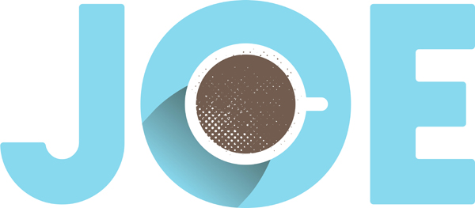

## Joes Coffee Project



Joes Coffee is a sample application that is used by Coveo for onboarding partners. It allows partners to demonstrate their development & resourcefullness skills while learning to do a basic Coveo implementation. Joes Coffee is a fictitious Coffee Shop with a striving community that helps Joe manage his online community for FAQ's and offers them a rich user experience while using Coveo as their main community Search.


## Installation Instructions

-   [Seting up your Environment for JoeCoffee using Salesforce DX](#setting-up-JoeCoffee-using-salesforce-dx): This is the recommended setup. Use this option if you are a developer.
-   [Next Steps](#next-steps): These steps are for following up with the project tasks on the Partner Training Platform.

## Pre-requisites
1. This project assumes you are familair with version control, Git and Github.
    -   In order to get familiar with the basics, follow the steps in the [Git and GitHub Basics](https://trailhead.salesforce.com/en/content/learn/modules/git-and-git-hub-basics) Trailhead module.

## Seting up your Environment for Joes Coffee using Salesforce DX

0. Get Started with Visual Studio Code. Follow the steps in the [Quick Start: Visual Studio Code for Salesforce Development](https://trailhead.salesforce.com/content/learn/projects/quickstart-vscode-salesforce) Trailhead project. The steps include:

-  Install Visual Studio Code
-  Install the Salesforce CLI
-  Use VS Code for Salesforce DEvelopment  

1. Set up your environment. Follow the steps in the [Quick Start: App Development with Salesforce DX](https://trailhead.salesforce.com/en/content/learn/modules/sfdx_app_dev) Trailhead module. The steps include:

-   Salesforce DX
-   Create an App
-   Build an App Using the Salesfsorce CLI
-   Convert and Deploy an Existing App

2. Authenticate with your hub org and provide it with an alias (**myDevHub** in the command below):

```
sfdx force:auth:web:login -d -a myDevHub
```

3. Clone the repository:

```
git clone https://github.com/gminero/joe-coffee.git
cd joe-cofee
```

4. Create a scratch org and provide it with an alias (**joescoffee** in the command below):

```
sfdx force:org:create -s -f config/project-scratch-def.json -a joescoffee
```

5. Push the app to your scratch org:

```
sfdx force:source:push
```

6. In **Setup**, under **User**, activate the **Knowledge User** setting for the admin.

7. Ensure that the Sys admin Profile has read/write access to the cusotm fields (origin_url__c, long_summary__c, topic__c)

8. Load sample Data:

```
sfdx force:data:tree:import --plan ./data/sample-data.json
```

9. Open the scratch org:

```
sfdx force:org:open
```

10. You should now publish your community for the community URL to work.

## Next Steps

1. Login to the [Partner Training Platform](https://101.coveo.com)
